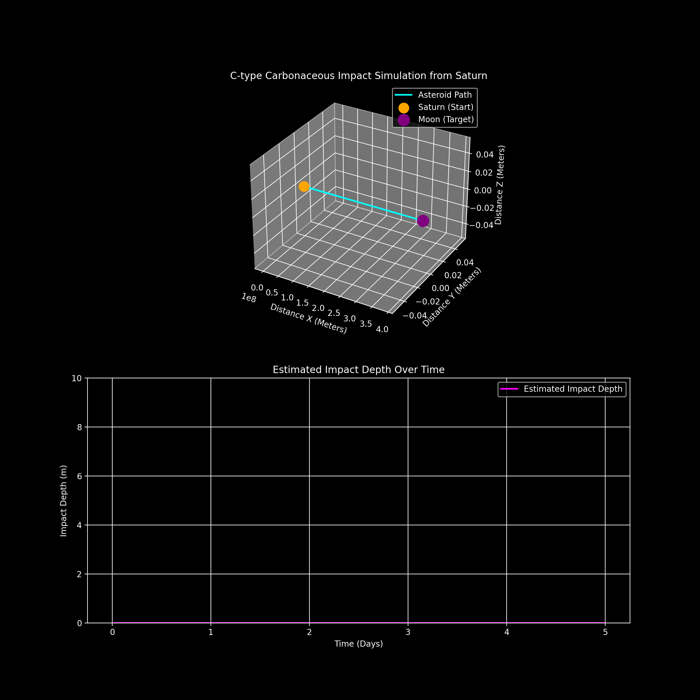

# Asteroid-Impact-Simulator
I am a 13-year-old developer focused on space-science simulations. In my latest project, I led the development of a 3D asteroid trajectory model. I handled everything from mission design (356mph/28-day path) to technical environment configuration and code iteration.(used aI to make this)
