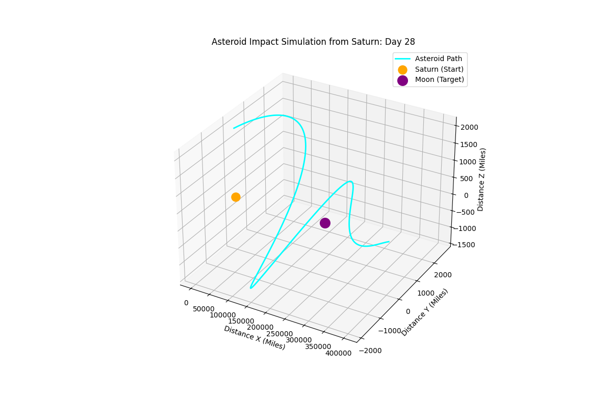

# Asteroid-Impact-Simulator
A 3D Python simulation of a 600mph asteroid trajectory from Saturn to the Moon over 28 days.
This project was developed with the assistance of AI to help structure the Python classes and generate the 3D coordinate logic. As the Project Lead, I:
Defined the mission parameters (600mph over 28 days).
Verified the mathematical accuracy of the trajectory.
Managed the environment configuration and terminal execution using uv.
Iterated on the 3D visualization to simulate a Saturn-to-Moon flight path.
